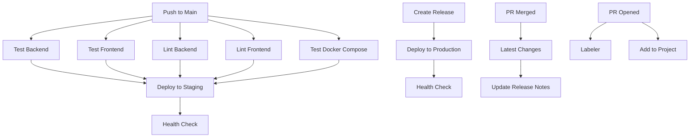

# Automation Workflows

## Overview

ELIMS includes several automation workflows to streamline project management, maintain code quality, and keep documentation up-to-date.

## Issue Manager

### Workflow File

`issue-manager.yml`

### Purpose

Automatically manages stale issues to keep the issue tracker clean and organized.

### Trigger

Runs on a schedule: Daily at 00:00 UTC

```yaml
schedule:
  - cron: '0 0 * * *'
```

### Features

1. **Stale Issue Detection**

   - Marks issues as stale after period of inactivity
   - Adds "stale" label
   - Posts comment notifying about staleness

1. **Auto-close Stale Issues**

   - Closes issues that remain stale after additional time
   - Configurable grace period

1. **Exemptions**

   - Issues with specific labels (e.g., "pinned", "security") are exempt
   - Pull requests can be handled separately

### Configuration

Customize in the workflow file:

```yaml
stale-issue-message: 'This issue has been automatically marked as stale...'
days-before-stale: 60  # Days before marking as stale
days-before-close: 7   # Days after stale before closing
exempt-issue-labels: 'pinned,security,help wanted'
```

### Best Practices

- Respond to issues before they become stale
- Use exempt labels for long-term issues
- Review stale issues before they auto-close

## Labeler

### Workflow File

`labeler.yml`

### Purpose

Automatically applies labels to pull requests based on changed files.

### Trigger

Runs on pull request events:

- opened
- synchronize (when commits are added)

### Configuration File

Labels are configured in `.github/labeler.yml`:

```yaml
backend:
  - backend/**/*
  - packages/elims-common/**/*

frontend:
  - frontend/**/*

docs:
  - docs/**/*
  - '*.md'
  - mkdocs.yml

docker:
  - compose.yml
  - compose.*.yml
  - '**/Dockerfile'

ci:
  - .github/workflows/**

config:
  - config/**/*
  - .env.example

tests:
  - backend/tests/**
  - frontend/tests/**
  - '**/test_*.py'
  - '**/*.spec.ts'
```

### Labels Applied

- `backend`: Changes to backend code
- `frontend`: Changes to frontend code
- `docs`: Documentation updates
- `docker`: Docker configuration changes
- `ci`: CI/CD workflow changes
- `config`: Configuration file changes
- `tests`: Test file changes

### Benefits

- Easier filtering and searching of PRs
- Automatic categorization
- Better organization
- Helps with release notes generation

## Latest Changes

### Workflow File

`latest-changes.yml`

### Purpose

Automatically updates release notes when pull requests are merged.

### Trigger

Runs when pull requests are closed:

- Only if PR was merged (not just closed)
- Checks `main` or `master` branch

### Features

1. **Release Notes Generation**

   - Extracts PR title and number
   - Categorizes by labels
   - Updates `docs/release-notes.md`

1. **Template-based**

   - Uses `.github/latest-changes-template.jinja2`
   - Customizable format

1. **Categorization**

   - Features: PRs labeled with `feature`
   - Bug Fixes: PRs labeled with `bug`
   - Documentation: PRs labeled with `docs`
   - Infrastructure: PRs labeled with `docker`, `ci`, `config`

### Template File

`.github/latest-changes-template.jinja2`

```jinja2
# Release Notes

## Latest Changes


### {{ category }}


* {{ change.title }} (#{{ change.number }})



```

### Release Note Format

Example output:

```markdown
## Latest Changes

### Features

* Add user authentication (#123)
* Implement instrument dashboard (#124)

### Bug Fixes

* Fix database connection timeout (#125)
* Resolve memory leak in MQTT handler (#126)

### Documentation

* Update installation guide (#127)
* Add API examples (#128)
```

### Configuration

Customize categories in the workflow file:

```yaml
categories:
  - title: Features
    labels:
      - feature
      - enhancement
  - title: Bug Fixes
    labels:
      - bug
      - fix
  - title: Documentation
    labels:
      - docs
```

## Add to Project

### Workflow File

`add-to-project.yml`

### Purpose

Automatically adds new issues and pull requests to GitHub Project boards.

### Trigger

Runs when:

- New issues are opened
- New pull requests are opened

### Configuration

Set up project:

1. Create a GitHub Project
1. Get project number from URL
1. Configure in workflow:

```yaml
project-url: https://github.com/users/FabienMeyer/projects/1
```

### Features

- Automatic addition to project board
- No manual triage needed
- Ensures nothing is missed
- Streamlines project management

### Setting Up

1. **Create GitHub Personal Access Token**

   - Go to: Settings > Developer settings > Personal access tokens
   - Generate token with `project` scope
   - Add as repository secret: `PROJECT_TOKEN`

1. **Configure Project URL**

   - Update workflow with your project URL

1. **Optional: Configure Column**

   - Specify which column to add items to
   - Default: backlog/triage column

## Lint Workflows

### Backend Linting

**File**: `lint-backend.yml`

**Purpose**: Run code quality checks on backend code

**Triggers**: Push to main, pull requests

**Checks**:

- `mypy`: Type checking
- `ruff check`: Linting
- `ruff format --check`: Format checking

### Frontend Linting

**File**: `lint-frontend.yml`

**Purpose**: Run code quality checks on frontend code

**Triggers**: Push to main, pull requests

**Checks**:

- Biome linting
- Code formatting
- Import sorting

## Pre-commit Workflow

### Workflow File

`pre-commit.yml`

### Purpose

Validates pre-commit hooks in CI to ensure they pass for all contributors.

### Trigger

Runs on pull requests

### Checks

- Runs all pre-commit hooks defined in `.pre-commit-config.yaml`
- Ensures hooks pass in CI environment
- Catches issues before merge

### Pre-commit Hooks

Configured in `.pre-commit-config.yaml`:

```yaml
repos:
  - repo: https://github.com/astral-sh/ruff-pre-commit
    rev: v0.8.4
    hooks:
      - id: ruff
        args: [--fix]
      - id: ruff-format

  - repo: https://github.com/pre-commit/mirrors-mypy
    rev: v1.13.0
    hooks:
      - id: mypy
        args: [--strict]

  - repo: https://github.com/biomejs/pre-commit
    rev: v0.10.1
    hooks:
      - id: biome-check
        args: [--write]
```

## Test Docker Compose Workflow

### Workflow File

`test-docker-compose.yml`

### Purpose

Tests the complete Docker Compose stack to ensure all services start correctly.

### Trigger

- Push to main/master
- Pull requests
- Changes to compose files

### Steps

1. **Checkout Code**
1. **Create Test .env File**
   - Uses test credentials
   - Configures all services
1. **Build Images**
   - Builds all Docker images
1. **Start Stack**
   - Brings up all services
1. **Wait for Services**
   - Allows time for initialization
1. **Test Services**
   - Checks all services are running
   - Tests health endpoints
1. **Cleanup**
   - Stops and removes containers
   - Cleans up volumes

### Services Tested

- Backend API
- Frontend
- MariaDB
- Redis
- Mosquitto MQTT
- Grafana
- Loki
- Alloy
- Traefik

### Health Checks

Verifies:

- All containers are running
- Services are responding
- Inter-service connectivity
- Port bindings

## Documentation Deployment

### Workflow File

`deploy-docs.yml`

### Purpose

Deploys versioned documentation to GitHub Pages using MkDocs and mike.

### Triggers

1. **Push to main**: Deploys as `dev` and `latest`
1. **Release published**: Deploys as version tag and `stable`
1. **Manual dispatch**: Allows manual deployment

### Features

- Version management with mike
- Automatic dev/latest updates
- Stable version on releases
- Version selector in docs

### Configuration

See [Documentation Deployment Guide](documentation.md) for details.

## Workflow Dependencies

### Workflow Execution Order



## Best Practices

### For All Workflows

1. **Keep Workflows Fast**

   - Use caching
   - Parallelize when possible
   - Optimize build steps

1. **Secure Secrets**

   - Never log secrets
   - Use GitHub secrets
   - Rotate regularly

1. **Clear Names**

   - Use descriptive workflow names
   - Clear step descriptions
   - Meaningful artifact names

1. **Error Handling**

   - Fail fast on errors
   - Provide clear error messages
   - Upload logs on failure

1. **Documentation**

   - Document required secrets
   - Explain triggers
   - Provide troubleshooting guides

### For Automation Workflows

1. **Test Locally**

   - Test pre-commit hooks locally
   - Verify labeler rules
   - Check release note generation

1. **Monitor Activity**

   - Review automated actions
   - Adjust timing if needed
   - Check for false positives

1. **Communicate Changes**

   - Notify team of automation
   - Document expected behavior
   - Provide opt-out mechanisms

## Troubleshooting

### Workflows Not Triggering

1. Check workflow syntax
1. Verify branch names
1. Check repository permissions
1. Review workflow filters

### Permission Errors

1. Check `GITHUB_TOKEN` permissions
1. Verify repository settings
1. Update workflow permissions section

### Failed Automation

1. Review workflow logs
1. Check configuration files
1. Verify secrets are set
1. Test manually if possible

## Related Documentation

- [CI/CD Overview](index.md)
- [Deployment Workflows](deployment.md)
- [Test Workflows](test-backend.md)
- [Documentation Deployment](documentation.md)
